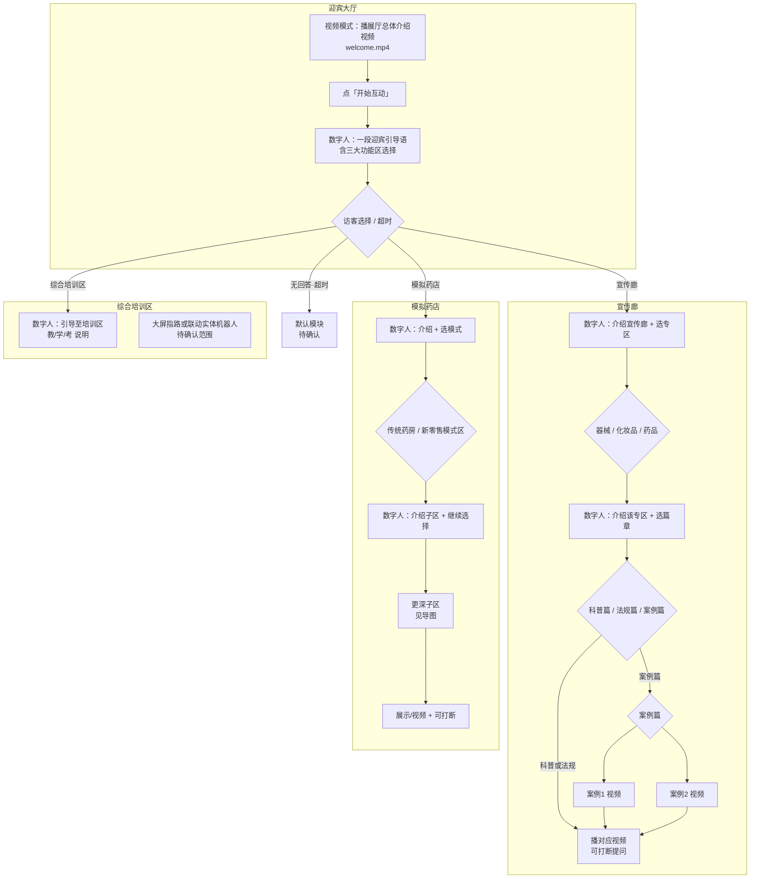

# 大屏数字人文案总表 v1

> 依据：`content/video-copy/云安市场监督管理局文案导图.xmind` + 同目录 docx  
> 状态：**流程与方向草案**，文案待逐条审阅定稿  
> 原则：**先改文本、后合成音频**；本表定稿后再改代码与 `gen_tts_audio.py`

---

## 0. 流程总览（修正版）

### 0.1 与你确认的关键理解

| 项 | 正确理解 | 不是 |
|----|----------|------|
| 迎宾「三部分」 | 数字人**讲一段话**，话里/话后引导访客在 **3 个主功能区** 中选择 | 连续播报三段独立话术 |
| 三个跳转入口 | **宣传廊 · 模拟药店 · 综合培训区**（导图「互动：下一环节选择」） | 科普/法规/案例（那是宣传廊更深层） |
| 视频 vs 数字人 | 迎宾/各篇章以**播视频为主**；数字人说**短引导语** | 数字人朗读 docx 全文 |

### 0.2 端到端流程



### 0.3 与现有代码的差距（改文案阶段先知晓）

| 能力 | 导图 / 本表 | 现有 `page.tsx` |
|------|-------------|-----------------|
| 迎宾三选一 | 宣传廊 / 模拟药店 / **综合培训区** | 仅宣传廊 / 模拟药店 |
| 宣传廊深度 | 专区 → **科普/法规/案例** → 视频 | 仅专区一层 |
| 案例篇 | **案例1 + 案例2** 两条视频 | 无 |
| 模拟药店深度 | 传统/新零售 → 药品区/非药品区 → 多个子区 | 仅传统/新零售 |
| 无回答 | **跳默认模块** | 35s 回视频模式 |
| 播片打断 | 视频播放中可问答 | 未实现 |

---

## 1. 文案类型说明

| 类型 | 用途 | 来源 | 谁朗读 |
|------|------|------|--------|
| **A · 数字人引导语** | 导航、提问、超时提示 | 本表 §2–§4 起草 | 数字人 TTS（预录） |
| **B · 视频旁白文案** | 视频制作 / 播放内容 | `video-copy/*.docx` | 视频音轨（非数字人全读） |
| **C · 知识库文案** | 打断问答、深度咨询 | `shared/knowledge-base/zones/` | Dify / Piper 动态（暂不预录） |

**v1 工作重点**：先把 **A 类** 全部定稿；**B 类** 以 docx 为准核对文件名与节点对应；**C 类** 标注映射，文本不改。

---

## 2. 迎宾大厅

| node_id | 触发 | 数字人引导语 A（v1 草稿） | 文案来源 | 视频 B | 关键词 | 备注 |
|---------|------|---------------------------|----------|--------|--------|------|
| `welcome.video` | 页面加载 / 视频模式 | （不说话） | — | `welcome.mp4` ← `展厅介绍文案.docx` | — | 带原声循环播 |
| `welcome.interact.guide` | 点「开始互动」 | 见下方 **§2.1 定稿候选** | 改写自 `展厅介绍文案.docx` | 背景视频暂停/静音 | — | **一段话**，非三段 |
| `welcome.choice.reprompt` | 答非所问 | 抱歉，您想参观宣传廊、体验模拟药店，还是前往综合培训区？ | 待写 | — | — | 中性 |
| `welcome.choice.timeout` | 选择超时（待定时长） | （可选）您暂未选择，我将带您参观【默认模块】… | 待写 | — | — | **默认模块待确认** |
| `welcome.kb` | 打断问答 | — | `序厅1-展厅形象墙.docx`<br>`序厅2-习近平总书记重要论述.docx` | — | — | C 类，不进 tts-map |

### 2.1 迎宾引导语 · 定稿候选（一段话）

> 以下由 `展厅介绍文案.docx` 压缩为口播长度，**请审阅后定稿**。

```
您好，我是安安，云安市场监管普法迎宾助手。
欢迎来到云浮市云安区药品监管综合培训法治教育基地。
基地建筑面积七百平方米，面向监管者、从业者和消费者，
设有宣传廊、模拟药店和综合培训区三大功能区。
请问您今天想参观宣传廊、体验模拟药店，还是前往综合培训区？
```

**待确认**

- [ ] 「综合培训区」在大屏上是否仅做**语音指路**（实体机器人在另一终端），还是大屏也要进培训区 UI？
- [ ] 无回答时**默认跳转**哪一个？（建议：宣传廊 → 化妆品 → 科普篇，或仅到宣传廊总览）
- [ ] 选择超时是否与「35s 回视频模式」分开计时？

---

## 3. 宣传廊

### 3.1 层级结构（导图）

```
宣传廊
├── 化妆区
│   ├── 科普篇 → 视频 + 科普知识库
│   ├── 法规篇 → 视频 + 法规知识库
│   └── 案例篇 → 案例1视频 + 案例2视频 + 案例知识库
├── 药品区（结构同化妆区）
└ 医疗器械展区（结构同化妆区）
```

### 3.2 数字人引导语 A

| node_id | 触发 | 数字人引导语 A（v1 草稿） | 视频 B（docx） | 知识库 C | 关键词 |
|---------|------|---------------------------|----------------|----------|--------|
| `corridor.enter` | 从迎宾进入 | {先生/女士/}，欢迎来到普法宣传廊。这里系统展示「两品一械」安全知识、法规与典型案例。您想先了解医疗器械、化妆品，还是药品？ | `corridor-overview.mp4`（总览片，待客户） | — | 器械/化妆品/药品/医疗 |
| `corridor.device.enter` | 选器械 | 这里是医疗器械展区。您想了解科普篇、法规篇，还是案例篇？ | — | — | 科普/法规/案例 |
| `corridor.cosmetic.enter` | 选化妆品 | 这里是化妆品展区。您想了解科普篇、法规篇，还是案例篇？ | — | — | 科普/法规/案例 |
| `corridor.drug.enter` | 选药品 | 这里是药品展区。您想了解科普篇、法规篇，还是案例篇？ | — | — | 科普/法规/案例 |
| `corridor.*.science.before` | 选科普篇 | 接下来为您播放【{专区名}科普篇】。播放过程中如有疑问，可以随时问我。 | 见 §3.3 | `*-科普篇.docx`（知识库） | 返回/换篇/模拟药店 |
| `corridor.*.law.before` | 选法规篇 | 接下来为您播放【{专区名}法规篇】。播放过程中如有疑问，可以随时问我。 | 见 §3.3 | `*-法规篇.docx`（知识库） | 同上 |
| `corridor.*.case.before` | 选案例篇 | 案例篇包含两个典型案例。您想先看案例一，还是案例二？ | — | 案例知识库 | 案例一/案例二/1/2 |
| `corridor.*.case1.before` | 选案例1 | 接下来为您播放案例一。播放过程中如有疑问，可以随时问我。 | 见 §3.3 | 同上 | 同上 |
| `corridor.*.case2.before` | 选案例2 | 接下来为您播放案例二。播放过程中如有疑问，可以随时问我。 | 见 §3.3 | 同上 | 同上 |
| `corridor.*.after` | 视频播完 | {先生/女士/}，本段内容就到这里。您还想了解其他篇章或其他专区吗？也可以说「返回」或「模拟药店」。 | — | — | 返回/换专区/模拟药店/迎宾 |
| `corridor.fallback` | 未识别 | 抱歉，没听清。您可以说「科普」「法规」「案例」，或「器械」「化妆品」「药品」换专区。 | — | — | — |

性别变体：`corridor.enter` 及之后节点用 先生/女士/中性 三套（与现有设计一致）。

### 3.3 视频 B · 文件映射

| 专区 | 篇章 | docx（旁白稿） | 建议 mp4 插槽名 | 状态 |
|------|------|----------------|-----------------|------|
| 化妆区 | 科普篇 | `化妆区-科普篇视频文案.docx` | `corridor-cosmetic-science.mp4` | 文案已有，视频待客户 |
| 化妆区 | 法规篇 | `化妆区-法规篇视频文案.docx` | `corridor-cosmetic-law.mp4` | 同上 |
| 化妆区 | 案例1 | `化妆区-案例篇视频文案1.docx` | `corridor-cosmetic-case1.mp4` | 同上 |
| 化妆区 | 案例2 | `化妆区-案例篇视频文案2.docx` | `corridor-cosmetic-case2.mp4` | 同上 |
| 药品区 | 科普篇 | `药品区-科普篇视频文案.docx` | `corridor-drug-science.mp4` | 同上 |
| 药品区 | 法规篇 | `药品区-法规篇视频文案.docx` | `corridor-drug-law.mp4` | 同上 |
| 药品区 | 案例1 | `药品区-案例篇视频文案1.docx` | `corridor-drug-case1.mp4` | 同上 |
| 药品区 | 案例2 | `药品区-案例篇视频文案2.docx` | `corridor-drug-case2.mp4` | 同上 |
| 医疗器械 | 科普篇 | `医疗器械区-科普篇视频文案.docx` | `corridor-device-science.mp4` | 同上 |
| 医疗器械 | 法规篇 | `医疗器械区-法规篇视频文案.docx` | `corridor-device-law.mp4` | 同上 |
| 医疗器械 | 案例1 | `医疗器械区-案例篇视频文案1.docx` | `corridor-device-case1.mp4` | 同上 |
| 医疗器械 | 案例2 | `医疗器械区-案例篇视频文案2.docx` | `corridor-device-case2.mp4` | 同上 |

**说明**：docx 为长稿（数百～千余字），供视频配音使用；数字人只说 §3.2 中的短引导语，不朗读全文。

---

## 4. 模拟药店

### 4.1 层级结构（导图）

```
模拟药店
├── 传统药房
│   ├── 药品区 → 处方药区 / 非处方药区 / 中药饮片专区 / 阴凉区
│   └── 非药品区 → 食品保健食品区 / 医疗器械区 / 化妆品区 / 其他产品区
└── 新零售模式区
    ├── 新特药销售区
    ├── 网络销售区（智慧药房）
    └── 自助售药柜
```

### 4.2 数字人引导语 A（v1 草稿）

| node_id | 触发 | 数字人引导语 A（v1 草稿） | 视频/素材 B | 关键词 |
|---------|------|---------------------------|-------------|--------|
| `pharmacy.enter` | 从迎宾/宣传廊进入 | {先生/女士/}，欢迎来到模拟药店体验区。这里还原日常监管中的典型场景。您想参观传统药房，还是新零售模式区？ | `pharmacy.mp4` | 传统/新零售 |
| `pharmacy.traditional.enter` | 选传统药房 | 传统药房分为药品区和非药品区。您想先看哪一类？ | 待客户 | 药品/非药品 |
| `pharmacy.traditional.drug.enter` | 选药品区 | 药品区包含处方药区、非处方药区、中药饮片专区和阴凉区。您想了解哪一块？ | 待客户 | 处方药/非处方药/中药/阴凉 |
| `pharmacy.traditional.nondrug.enter` | 选非药品区 | 非药品区包含食品保健食品、医疗器械、化妆品和其他产品区。您想了解哪一块？ | 待客户 | 食品/器械/化妆品/其他 |
| `pharmacy.newretail.enter` | 选新零售 | 新零售模式区包含新特药销售区、网络销售区和自助售药柜。您想了解哪一块？ | 待客户 | 新特药/网络/智慧/自助 |
| `pharmacy.leaf.before` | 进入叶子区 | 接下来为您展示【{子区名}】。请留意其中的合规要点；有疑问可以随时问我。 | 各子区视频待客户 | 返回/宣传廊/迎宾 |
| `pharmacy.leaf.after` | 展示结束 | 本区内容就到这里。您还想看其他区域吗？也可以说「返回」或「宣传廊」。 | — | 同上 |
| `pharmacy.fallback` | 未识别 | 抱歉，没听清。您可以说「传统药房」「新零售」，或具体区域名称。 | — | — |

**待确认**

- [ ] 模拟药店各叶子节点的 **B 类视频文案** 客户是否另行提供？（当前 `video-copy/` 无对应 docx）
- [ ] 「128 个典型问题」是 UI 展示还是语音逐项引导？

---

## 5. 综合培训区

导图将 **综合培训区 · 智能机器人（教/学/考）** 列为与宣传廊、模拟药店并列的第三入口。

| node_id | 触发 | 数字人引导语 A（v1 草稿） | 关联 | 备注 |
|---------|------|---------------------------|------|------|
| `training.enter` | 迎宾三选一 | {先生/女士/}，综合培训区配备智能机器人安安，支持「教、学、考」一体化实训。请您前往培训区，在机器人端开始互动；如需返回，请说「返回迎宾」。 | 实体小智机器人 | **大屏职责待确认** |
| `training.pointer` | （可选）仅指路 | 培训区在本基地【物理位置描述待填】。大屏为您播放培训区介绍视频。 | 待客户视频 | 若大屏不做教/学/考 |

知识库映射（C 类，供机器人 / 后续 Dify）：

| 模式 | 知识库 docx |
|------|-------------|
| 教 | 序厅1、序厅2、化妆品/药品/器械 法规篇 |
| 学 | 同上 |
| 考 | 考题知识库.docx |

---

## 6. 全局话术

| node_id | 触发 | 数字人引导语 A（v1 草稿） |
|---------|------|---------------------------|
| `global.return` | 说「返回」 | （上下文）回上一级；顶层回迎宾 |
| `global.home` | 说「回迎宾/首页」 | 好的，带您回到迎宾大厅。 |
| `global.cross` | 跨区点名 | 好的，带您去【目标区】。 |
| `global.interrupt.ack` | 播片时打断 | 好的，请说您的问题。 |
| `global.interrupt.resume` | 问答结束 | 继续为您播放。 |
| `global.idle.video` | 长时间无操作 | （现有）回视频模式，清空对话 |

---

## 7. 预录音频规划（文本定稿后执行）

| 类别 | 预估条数 | 说明 |
|------|----------|------|
| 迎宾 | 2–3 | 引导 + 重问 + 可选超时 |
| 宣传廊引导 | 约 12 × 3 性别 | enter + 3 专区 + 篇章前后 + fallback |
| 模拟药店引导 | 约 10 × 3 性别 | 随叶子数增加 |
| 综合培训 | 1–2 × 3 性别 | 视大屏职责 |
| 全局 | 4–6 | 返回/打断等 |
| **合计** | **约 60–80 条** | 现有 21 条需全量重做 |

**不预录**：Dify / Piper 动态问答（C 类知识库内容）。

---

## 8. 下一步（仍不改代码）

1. **你审阅 §2.1 迎宾一段话**，确认三选一表述与「综合培训区」大屏职责  
2. **确认默认模块**与超时策略（§2 待确认项）  
3. **逐条审阅 §3.2 / §4.2 短引导语**，可按 docx 语气微调  
4. **核对 §3.3 视频文件名**与客户成片命名是否一致  
5. 定稿后在表中把「v1 草稿」改为「已定稿」，再进入代码 + `gen_tts_audio.py` 阶段  

---

## 附录 A · 导图节点 ↔ docx 完整对照

| 导图路径 | docx / 素材 |
|----------|-------------|
| 欢迎环节 → 展厅总体介绍 → 视频文案 | `展厅介绍文案.docx` |
| 欢迎环节 → 展厅总体介绍 → 知识库文案 | `shared/.../序厅1`、`序厅2` |
| 宣传廊 → 化妆区 → 科普/法规/案例 | `化妆区-*视频文案*.docx` |
| 宣传廊 → 药品区 → 科普/法规/案例 | `药品区-*视频文案*.docx` |
| 宣传廊 → 医疗器械展区 → 科普/法规/案例 | `医疗器械区-*视频文案*.docx` |
| 综合培训区 → 教/学 | 序厅 + 三区法规篇 docx |
| 综合培训区 → 考 | 考题知识库.docx |

---

*文档版本：v1 · 2026-08-13 · 对应仓库 `big-screen/content/video-copy/` 导图与 docx*
