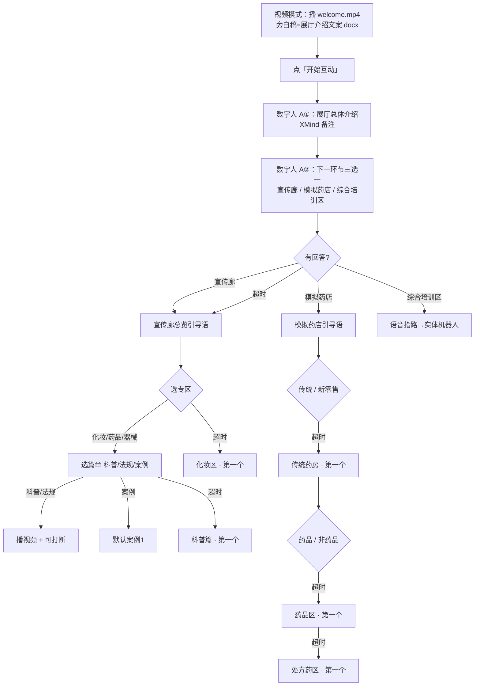

# 大屏数字人文案总表 v2

> **文案来源原则（已确认）**  
> - **A · 数字人引导语**：以 `video-copy/云安市场监督管理局文案导图.xmind` 各节点备注为准（本表 §3 全文摘录）  
> - **B · 视频旁白**：以 `video-copy/*.docx` 为准；`展厅介绍文案.docx` **仅**对应迎宾成片，不是数字人口播  
> - **C · 知识库**：`shared/knowledge-base/zones/` 及导图标注的 docx，供打断问答 / 实体机器人  
>  
> **行为规则（已确认）**  
> - 综合培训区：大屏 **仅语音指路** 至实体机器人，不展开教/学/考 UI  
> - 无回答超时：跳当前层级的 **第一个选项**；迎宾三选一超时 → **宣传廊总览**  
>  
> 状态：流程与文案方向定稿；叶子节点无导图备注的条目待补  
> 下一步：审阅 XMind 原文 → 定稿 → 改代码 → 再 `gen_tts_audio.py`

---

## 1. 流程（v2 定稿）



### 1.1 迎宾两段口播（非「三段连播」）

| 顺序 | XMind 节点 | 作用 |
|------|------------|------|
| ① | 欢迎环节 → **展厅总体介绍** | 进入互动后第一段（你截图中的文案） |
| ② | 欢迎环节 → **互动：下一环节选择** | 第二段：三选一提问 |
| — | 展厅总体介绍 → **视频文案** | → `展厅介绍文案.docx` → **welcome.mp4**，数字人不读 |

「三部分」= ② 之后的 **三个跳转目的地**（宣传廊 / 模拟药店 / 综合培训区），不是连播三段话。

### 1.2 默认跳转规则

| 选择层级 | 可选项（导图顺序） | 超时默认 |
|----------|-------------------|----------|
| 迎宾三选一 | 宣传廊 / 模拟药店 / 综合培训区 | **宣传廊总览** |
| 宣传廊专区 | 化妆区 / 药品区 / 医疗器械展区 | 化妆区 |
| 篇章 | 科普篇 / 法规篇 / 案例篇 | 科普篇 |
| 案例篇 | 案例1 / 案例2 | 案例1 |
| 模拟药店模式 | 传统药房 / 新零售模式区 | 传统药房 |
| 传统药房 | 药品区 / 非药品区 | 药品区 |
| 药品区 | 处方药区 / 非处方药区 / 中药饮片专区 / 阴凉区 | 处方药区 |
| 非药品区 | 食品保健食品区 / 医疗器械区 / 化妆品区 / 其他产品区 | 食品保健食品区 |
| 新零售 | 新特药销售区 / 网络销售区 / 自助售药柜 | 新特药销售区 |

---

## 2. 文案类型对照

| 类型 | 谁读 | 来源 |
|------|------|------|
| **A** 数字人引导 | 安安 TTS（预录） | **XMind 节点备注** |
| **B** 视频旁白 | 成片音轨 | `video-copy/*视频文案*.docx`；迎宾=`展厅介绍文案.docx` |
| **C** 知识库 | 打断问答 / 机器人 | 导图「知识库」子节点 → `shared/knowledge-base/` |

---

## 3. A 类数字人引导语 · 摘自 XMind（原文）

> 以下从导图备注 **逐字摘录**。标 ⚠️ 为导图内疑似笔误或引用错误，定稿前请客户确认。

### 3.1 迎宾

#### `welcome.intro` — 展厅总体介绍

```
尊敬的各位领导、各位来宾，大家好！欢迎来到云浮市云安区药品监管综合培训法治教育基地。我是讲解员“安安”，今天将由我全程引导大家参观学习，首先为大家做总体介绍。
```

| 子节点 | 类型 | 引用 |
|--------|------|------|
| 视频文案 | B | `展厅介绍文案.docx` → `welcome.mp4` |
| 知识库文案 | C | 序厅1-展厅形象墙.docx、序厅2-习近平总书记重要论述.docx |

#### `welcome.choice` — 互动：下一环节选择

```
各位已经对展厅有了整体印象，接下来我们就开启今天的参观培训之旅。展厅分为三个功能区：模拟药店、宣传廊和综合培训区。请问您希望先从哪个区域开始？
```

| 关键词 | 跳转 |
|--------|------|
| 宣传廊 / 走廊 / 展区… | 宣传廊总览 |
| 模拟药店 / 药店… | 模拟药店 |
| 综合培训区 / 培训… | 语音指路（§3.4） |
| 超时 | **宣传廊总览** |

---

### 3.2 宣传廊

#### `corridor.enter` — 宣传廊

```
欢迎来到宣传廊！这里聚焦“两品一械”，通过科普、法规、案例三大模块，为您带来一场内容丰富、实用易懂的知识之旅。展区分为化妆品区、药品区和医疗器械区，您可自由选择从任一区域开始，也可按顺序逐一参观。
```

| 关键词 | 跳转 | 超时默认 |
|--------|------|----------|
| 化妆品 / 化妆 | 化妆区 | **化妆区** |
| 药品 | 药品区 | |
| 器械 / 医疗器械 | 医疗器械展区 | |

#### `corridor.cosmetic` — 化妆区

```
大家好！欢迎走进云浮市云安区药品监管综合培训法治教育基地的化妆区，爱美之心，人皆有之。化妆品，就是我们日常用于皮肤、毛发、唇齿间的清洁与美化之物。今天，在美丽妆颜展区，我们只做一件事——让您在轻松体验中，学会科学选择、正确使用、安全消费，让美丽更从容、更安心。
化妆区设有科普、法规、案例三大篇章，您可任选其一，开启今日的学习之旅。
```

#### `corridor.cosmetic.science` — 科普篇

```
大家好！欢迎走进云浮市云安区药品监管综合培训法治教育基地的科普区。化妆科普区涵盖三大板块：古代化妆技艺、彩妆发展演变历程，以及安全用妆知识。
```

→ 播 B：`化妆区-科普篇视频文案.docx` · C：`化妆品展区-科普篇.docx`

#### `corridor.cosmetic.law` — 法规篇

```
大家好！欢迎走进云浮市云安区药品监管综合培训法治教育基地的法规区。化妆品监督管理条例2021年1月1日起正式施行，关键要点包括：
· 鼓励行业创新
· 实施风险管理
· 加强生产经营全过程管理
· 加大违法行为惩处力度
```

→ 播 B：`化妆区-法规篇视频文案.docx` · C：`化妆品展区-法规篇.docx`

#### `corridor.cosmetic.case` — 案例篇

```
大家好！欢迎走进云浮市云安区药品监管综合培训法治教育基地的案例警示区。法律的生命在于实施，而案例是最好的教科书。今天，我将通过两个真实发生的化妆品违法案件，带大家深刻认识违法代价，敲响安全警钟。
```

| 子节点 | B 类 docx |
|--------|-----------|
| 案例1 | `化妆区-案例篇视频文案1.docx` |
| 案例2 | `化妆区-案例篇视频文案2.docx` |
| 案例知识库 | `化妆品展区-案例篇.docx` |

超时默认：**案例1**

---

#### `corridor.drug` — 药品区

```
大家好！欢迎走进云浮市云安区药品监管综合培训法治教育基地的药品区，健康是生命之本，药品与健康息息相关。药品包括中药、化学药、生物制品等，用于预防、治疗和诊断疾病。我们的药品展区以“安全”为核心，带您了解药品发展历史、科学用药常识和最新监管法规，并通过真实案例以案说法，让您从“学法”者成为“宣法”者，汇聚社会共治合力，共同推动药品安全全过程监管。
药品区设有科普、法规、案例三大篇章，您可任选其一，开启今日的学习之旅。
```

#### `corridor.drug.science` — 科普篇

```
大家好！欢迎走进云浮市云安区药品监管综合培训法治教育基地的科普区区。本区域为您介绍中西药交流史，如青霉素、青蒿素等重大发现，区分处方非处方药，指导家庭备药，纠正常见误区，倡导科学合理安全用药。
```

⚠️ 「科普区区」疑似笔误，定稿改为「科普区」。

→ B：`药品区-科普篇视频文案.docx` · C：`药品展区-科普篇.docx`

#### `corridor.drug.law` — 法规篇

```
大家好！欢迎走进云浮市云安区药品监管综合培训法治教育基地的法规区。《药品管理法实施条例》的修订施行，标志着我国药品监管法治体系更加完善、更加科学。让我们共同尊法、学法、守法、用法，以法治力量守护每一粒药品的安全，守护人民群众的生命健康！
```

→ B：`药品区-法规篇视频文案.docx` · C：`药品展区-法规篇.docx`

#### `corridor.drug.case` — 案例篇

```
大家好！欢迎走进云浮市云安区药品监管综合培训法治教育基地的案例警示区。法律的生命在于实施，而案例是最好的教科书。今天，我将通过两个真实发生的药品违法案件，带大家深刻认识违法代价，敲响安全警钟。
```

⚠️ 导图案例1/2 备注误写为「化妆区-案例篇…」，应以 **`药品区-案例篇视频文案1/2.docx`** 为准。

---

#### `corridor.device` — 医疗器械展区

```
大家好！欢迎走进云浮市云安区药品监管综合培训法治教育基地的医疗器械区，医疗器械是为了预防、诊断、治疗疾病等目的，直接或者间接作用于人体的仪器、设备、器具、体外诊断试剂及校准物、材料以及其他类似或者相关的物品。
对保障公众身体健康和生命安全、改善生活质量等具有重要作用。医疗器械种类多，跨度大，涵盖了小到棉签、创可贴，大到核磁共振仪器等诊疗设备。
今天我们通过展示医疗器械的发展历程、相关法律法规、各种类型的医疗器械及其在保障人类健康方面的应用，来提高大众对医疗器械的科学认知。
医疗器械区设有科普、法规、案例三大篇章，您可任选其一，开启今日的学习之旅。
```

#### `corridor.device.science` — 科普篇

```
大家好！欢迎走进云浮市云安区药品监管综合培训法治教育基地的科普区区。本区域为您介绍医疗器械，从纱布到3D器官，无处不在，与生命健康息息相关。了解它，用好它，守护健康！
```

⚠️ 「科普区区」→「科普区」

→ B：`医疗器械区-科普篇视频文案.docx` · C：`医疗器械展区-科普篇.docx`

#### `corridor.device.law` — 法规篇

```
大家好！欢迎走进云浮市云安区药品监管综合培训法治教育基地的法规区。《医疗器械监督管理条例》，为每一件器械的安全把关，为您我的生命健康护航！
```

→ B：`医疗器械区-法规篇视频文案.docx` · C：`医疗器械展区-法规篇.docx`

#### `corridor.device.case` — 案例篇

```
大家好！欢迎走进云浮市云安区药品监管综合培训法治教育基地的案例警示区。法律的生命在于实施，而案例是最好的教科书。今天，我将通过两个真实发生的医疗器械违法案件，带大家深刻认识违法代价，敲响安全警钟。
```

→ B：`医疗器械区-案例篇视频文案1/2.docx` · C：`医疗器械展区-案例篇.docx`

---

### 3.3 模拟药店

#### `pharmacy.enter` — 模拟药店

```
欢迎走进模拟药店，按照 GSP 要求建设，本区域划分为传统药房和新零售模式区，模拟药店既是监管人员和从业人员“教、学、考、赛”一体化的实训室，也为广大群众提供了一个虚拟现实化的科普法宣新阵地。
```

超时默认：**传统药房**

#### `pharmacy.traditional` — 传统药房

```
大家好！欢迎走进云浮市云安区药品监管综合培训法治教育基地的传统药房区，传统药房分为药品区和非药品区。您可以选一个区域开始学习。
```

超时默认：**药品区**

#### `pharmacy.traditional.drug` — 药品区

```
大家好！欢迎走进云浮市云安区药品监管综合培训法治教育基地的传统药房的药品区，药品区主要包括处方药区、非处方药区、中药饮片专区、阴凉区。您可以选择一个区域开始学习。
```

超时默认：**处方药区**

| 叶子节点 | XMind 引导语 | 状态 |
|----------|-------------|------|
| 处方药区 | （空） | 待客户补 A 类或复用上级 |
| 非处方药区 | （空） | 同上 |
| 中药饮片专区 | （空） | 同上 |
| 阴凉区 | （空） | 同上 |

#### `pharmacy.traditional.nondrug` — 非药品区

```
大家好！欢迎走进云浮市云安区药品监管综合培训法治教育基地的传统药房的非药品区，非药品区主要包括食品保健食品区、医疗器械区、化妆品区、其他产品区。您可以选择一个区域开始学习。
```

超时默认：**食品保健食品区**（叶子节点 A 类均为空，待补）

#### `pharmacy.newretail` — 新零售模式区

```
大家好！欢迎走进云浮市云安区药品监管综合培训法治教育基地的新零售模式区，新零售模式区包括新特药销售区、网络销售区（智慧药房）、自助售药柜等，后续也可以根据药品零售发展模式增加相关功能。您可以选择一个区域开始学习。
```

超时默认：**新特药销售区**（三个叶子 A 类均为空，待补）

---

### 3.4 综合培训区（大屏仅指路 · v2 起草）

> 导图节点 **无备注**；按「仅语音指路到实体机器人」起草，**待你确认后写入 XMind**。

#### `training.pointer`

```
好的，综合培训区在本基地【物理位置待填】。那里配备智能机器人安安，支持“教、学、考”一体化实训，请您移步至培训区，在机器人端开始互动。如需继续参观大屏，请说“返回迎宾”。
```

- 大屏 **不切换场景 UI**，不播培训区视频  
- 实体机器人知识库见导图「教 / 学 / 考」子节点（C 类）

---

## 4. B 类视频 · docx 与建议插槽

| 场景 | docx | 建议 mp4 |
|------|------|----------|
| 迎宾成片 | `展厅介绍文案.docx` | `welcome.mp4` ✅ |
| 宣传廊总览 | （待客户） | `corridor-overview.mp4` ✅ |
| 化妆区 科普/法规/案例1/2 | `化妆区-*.docx` | `corridor-cosmetic-{science,law,case1,case2}.mp4` |
| 药品区 同上 | `药品区-*.docx` | `corridor-drug-*.mp4` |
| 器械区 同上 | `医疗器械区-*.docx` | `corridor-device-*.mp4` |
| 模拟药店各叶子 | （待客户） | `pharmacy-*.mp4` |

---

## 5. 与现有代码差异（实施备忘）

| 项 | v2 定稿 | 现有 `page.tsx` |
|----|---------|-----------------|
| 迎宾口播 | **两段**（总体介绍 + 三选一） | 仅 `welcomeLine` 一句 |
| 文案来源 | XMind 备注 | 硬编码 `scriptFor` |
| 第三入口 | 综合培训区指路 | 无 |
| 宣传廊深度 | 专区 → 篇章 → 视频 | 仅专区 |
| 默认跳转 | 每层第一个；迎宾→宣传廊总览 | 35s 回视频模式 |
| 视频/口播 | `展厅介绍文案.docx` 只给视频 | 曾混用为口播稿 |

---

## 6. 预录规划（文本定稿后）

- 预录范围：**§3 全部 A 类**（含 `training.pointer` 定稿版）  
- 性别变体：迎宾两段 **中性**；宣传廊/模拟药店进入后按 先生/女士/中性（与现设计一致）  
- 预估 **50+ 条** mp3（比 v1 估算少，因口播以 XMind 为准、不再自起草）  
- **C 类不打预录**；**B 类走视频音轨**，不进 `tts-map.json`

---

## 7. 待办清单

- [ ] 确认 §3.4 综合培训区指路话术 + 物理位置描述  
- [ ] 修正 XMind：药品区案例 docx 引用、科普区错字  
- [ ] 补全模拟药店叶子节点 A 类（或约定复用上级 + 直接播片）  
- [ ] 确认各层「选择超时」时长（是否与 35s 回视频模式并存）  
- [ ] 全文定稿 → 更新 `page.tsx` / 状态机 → `gen_tts_audio.py`

---

*版本 v2 · 2026-08-13 · A 类全文来自 XMind 备注提取*
