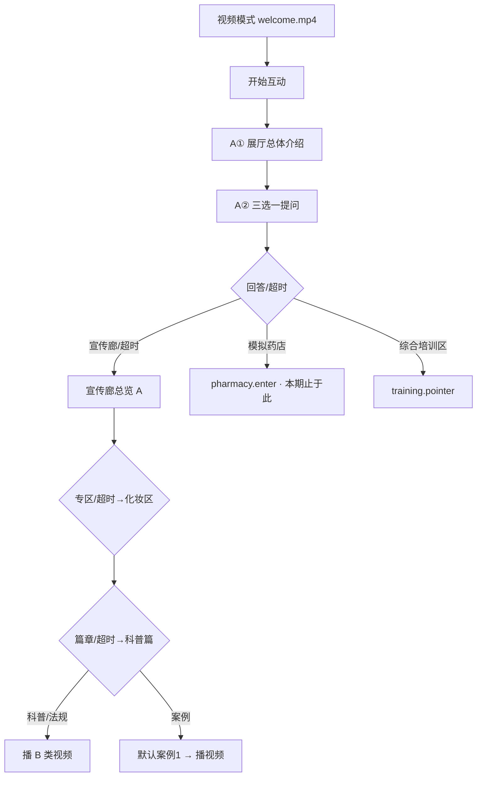

# 大屏数字人文案总表 v3

> **权威来源**  
> - A 类数字人引导：`video-copy/云安市场监督管理局文案导图.xmind` 节点备注  
> - B 类视频旁白：`video-copy/*.docx`（`展厅介绍文案.docx` **仅**迎宾成片）  
> - C 类知识库：`shared/knowledge-base/zones/` 等  
>  
> **行为规则**  
> - 综合培训区：大屏 **仅语音指路** → 实体机器人  
> - 超时默认：当前层级 **第一个**；迎宾三选一 → **宣传廊总览**  
>  
> **本期范围（v3）**  
> - ✅ 迎宾两段口播 + 三选一 + 宣传廊全链路（专区 → 篇章 → 视频/案例）  
> - ✅ 综合培训区指路  
> - ⏸ **模拟药店子区搁置**（后续需图片识别判对错；本期不下钻到药品区/非药品区/叶子）  
>  
> 状态：**流程与文案方向已定稿** → 下一步改代码（仍不合成音频）

---

## 1. 本期实施范围

### 1.1 做

| 模块 | 深度 | 说明 |
|------|------|------|
| 迎宾 | 视频 + A① + A② + 三选一 | `welcome.mp4` + XMind 两段口播 |
| 宣传廊 | 总览 → 3 专区 → 科普/法规/案例 → 播 B 类视频 | 案例篇含案例1/2；可打断问答为后续增强 |
| 综合培训区 | 仅 `training.pointer` | 不切换大屏 UI |
| 模拟药店 | **仅 `pharmacy.enter`** | 可说「传统/新零售」关键词，**不进入**子区导航与图片识别 |

### 1.2 不做（搁置）

| 模块 | 原因 |
|------|------|
| 模拟药店 → 传统药房/新零售 **以下** | 需 **图片识别 + 对错判定**；导图叶子节点亦无独立 A 类文案 |
| 模拟药店各叶子视频 / 128 题实训 | 待客户素材 + 识别方案 |

### 1.3 模拟药店本期行为（建议）

访客从迎宾说「模拟药店」或手动进入时：

1. 数字人播 XMind **`pharmacy.enter`** 引导语  
2. 背景播现有 `pharmacy.mp4`（有则播，无则回退）  
3. 若访客说「传统」「新零售」等 → 友好提示：**「子区互动功能即将开放，请先参观宣传廊，或说返回迎宾。」**（文案实施阶段再定一条 fallback）  
4. **不**更新 `zone` / 不下钻状态机  

> 若你希望本期仍保留「传统 vs 新零售」两层（仅切视频、不做识别），实施时可改为只做这一层；默认按上面「仅 enter」最简方案。

---

## 2. 流程图（本期）



---

## 3. 默认跳转

| 层级 | 选项（导图顺序） | 超时 → |
|------|------------------|--------|
| 迎宾三选一 | 宣传廊 / 模拟药店 / 综合培训区 | **宣传廊总览** |
| 宣传廊专区 | 化妆区 / 药品区 / 医疗器械展区 | 化妆区 |
| 篇章 | 科普篇 / 法规篇 / 案例篇 | 科普篇 |
| 案例 | 案例1 / 案例2 | 案例1 |

~~模拟药店深层默认~~ → **本期不适用（搁置）**

---

## 4. XMind 复核记录（2026-08-13）

你已修改问题 1、2；仓库副本复核结果：

| 项 | 状态 |
|----|------|
| 化妆区 · 科普篇口播「科普区」 | ✅ 已修正（无双「区」） |
| 药品区 · 案例1/2 → docx 引用 | ⚠️ 节点备注仍写「化妆区-案例篇…」；**实施 B 类映射以 `药品区-案例篇视频文案1/2.docx` 为准** |
| 药品区 / 器械区 · 科普篇「科普区区」 | ⚠️ 口播备注仍存在；**代码/TTS 用「科普区」** |
| 综合培训区 · A 类指路话术 | 导图仍无备注；用 §5.4 起草稿，物理位置待填 |

---

## 5. A 类引导语（摘自 XMind · 本期会用到的节点）

### 5.1 迎宾

**`welcome.intro` — 展厅总体介绍**

```
尊敬的各位领导、各位来宾，大家好！欢迎来到云浮市云安区药品监管综合培训法治教育基地。我是讲解员“安安”，今天将由我全程引导大家参观学习，首先为大家做总体介绍。
```

| 子节点 | 类型 | 引用 |
|--------|------|------|
| 视频文案 | B | `展厅介绍文案.docx` → `welcome.mp4` |
| 知识库文案 | C | 序厅1、序厅2 docx |

**`welcome.choice` — 互动：下一环节选择**

```
各位已经对展厅有了整体印象，接下来我们就开启今天的参观培训之旅。展厅分为三个功能区：模拟药店、宣传廊和综合培训区。请问您希望先从哪个区域开始？
```

---

### 5.2 宣传廊（本期完整实现）

以下 A 类全文与 v2 §3.2 相同，此处不重复粘贴；节点列表：

| node_id | XMind 节点 |
|---------|------------|
| `corridor.enter` | 宣传廊 |
| `corridor.cosmetic` | 化妆区 |
| `corridor.cosmetic.science/law/case` | 科普/法规/案例篇 |
| `corridor.drug` | 药品区 |
| `corridor.drug.science/law/case` | 同上 |
| `corridor.device` | 医疗器械展区 |
| `corridor.device.science/law/case` | 同上 |

**B 类映射（案例篇 · 实施以文件名为准）**

| 专区 | 科普 | 法规 | 案例1 | 案例2 |
|------|------|------|-------|-------|
| 化妆区 | 化妆区-科普篇… | 化妆区-法规篇… | 化妆区-案例篇…1 | …2 |
| 药品区 | 药品区-科普篇… | 药品区-法规篇… | **药品区-案例篇…1** | **…2** |
| 器械区 | 医疗器械区-科普篇… | …法规… | 医疗器械区-案例篇…1 | …2 |

口播实施时对药品/器械科普篇将「科普区区」读作「科普区」。

---

### 5.3 模拟药店（本期 · 仅 enter）

**`pharmacy.enter`**

```
欢迎走进模拟药店，按照 GSP 要求建设，本区域划分为传统药房和新零售模式区，模拟药店既是监管人员和从业人员“教、学、考、赛”一体化的实训室，也为广大群众提供了一个虚拟现实化的科普法宣新阵地。
```

**`pharmacy.deferred`**（本期 fallback，待你确认措辞）

```
子区实训与图片识别功能正在完善中。您可以说「宣传廊」继续参观，或说「返回迎宾」回到大厅。
```

以下节点 **本期不导航**：传统药房、药品区、非药品区、新零售及各叶子（XMind 有 A 类备注，留待图片识别版启用）。

---

### 5.4 综合培训区（指路 · 待填位置）

**`training.pointer`**

```
好的，综合培训区在本基地【物理位置待填】。那里配备智能机器人安安，支持“教、学、考”一体化实训，请您移步至培训区，在机器人端开始互动。如需继续参观大屏，请说“返回迎宾”。
```

---

## 6. 与 `page.tsx` 改造对照（实施备忘）

| 改造项 | 说明 |
|--------|------|
| 迎宾 | `enterInteractive` 连播 A① + A②；非单句 `welcomeLine` |
| 文案源 | XMind 备注 → 建议抽 `content/scripts.json`（node_id → text） |
| 状态机 | 增加 `chapter: science \| law \| case1 \| case2` |
| 视频插槽 | 宣传廊 9+2 案例 mp4 命名见 v2 §4 |
| 默认跳转 | 各层 timeout → 第一个；迎宾 → corridor.enter |
| 模拟药店 | 仅 `scene=pharmacy`，不 SET zone/aspect 下钻 |
| 综合培训 | 触发 `training.pointer`，不 `setNav` 到新 scene |
| 音频 | **文本定稿后再** `gen_tts_audio.py` |

---

## 7. 待办

- [ ] 确认 `pharmacy.deferred` fallback 措辞  
- [ ] 填写综合培训区 **物理位置**  
- [ ] （可选）同步修正 XMind 药品区案例 docx 引用、科普区错字  
- [ ] 开始 `page.tsx` 改造  
- [ ] 全链路联调通过后批量预录 TTS  

---

*版本 v3 · 2026-08-13 · 完整 A 类原文见 `文案总表-v2.md` §3（宣传廊/模拟药店 enter 未改）*
