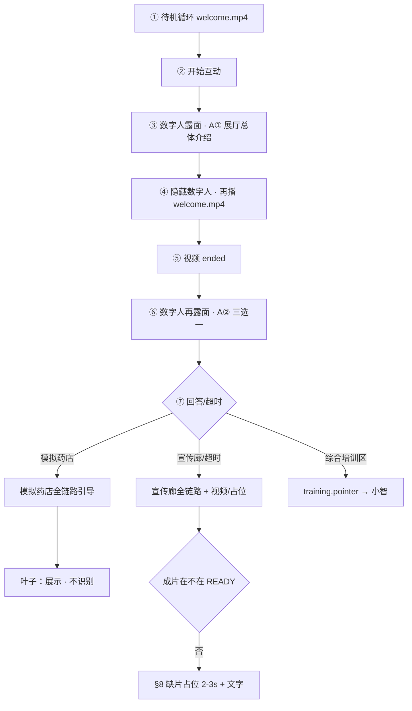

# 大屏数字人文案总表 v4

> **唯一导图文件**  
> `big-screen/content/video-copy/云安市场监督管理局导图V2.xmind`  
> （原「文案导图.xmind」已更名；仓库内仅此一份）  
>  
> **文案来源**  
> - **A** 数字人引导 → XMind 节点备注（逐字）  
> - **B** 视频旁白 → `video-copy/*.docx`；`展厅介绍文案.docx` 仅迎宾成片  
> - **C** 知识库 → `shared/knowledge-base/zones/` 等  
>  
> **行为规则**  
> - 超时默认：当前层级 **第一个**；迎宾三选一 → **宣传廊总览**  
> - **综合培训区**：**大屏数字人**口播引导、指路；**教/学/考** 由 **小智实体机器人** 完成  
> - **模拟药店叶子节点**：数字人引导 + 跳转 + 展示到位；**不做**图片识别与对错判定（后续迭代）  
>  
> **缺片策略**  
> - 客户成片未到时：**2–3 秒占位视频** + 画面文字标明缺哪一块（见 §8）  
> - **不再**用「回退到父场景已就绪视频」冒充缺片（与现 `FALLBACK` 策略不同，实施时替换）  
>  
> 状态：流程与文案已定稿 → 下一步改代码（仍不合成音频）

---

## 1. XMind 复核（2026-08-13 · V2 文件）

| 检查项 | 结果 |
|--------|------|
| 文件名 | `云安市场监督管理局导图V2.xmind` |
| 节点总数 / 有备注 | 73 / 43 |
| 化妆/药品/器械 · 科普篇「科普区」 | ✅ 已修正 |
| 药品区 · 案例1/2 docx 引用 | ✅ `药品区-案例篇视频文案1/2.docx` |
| 综合培训区 · A 类备注 | ⚠️ XMind 仍为空 → 用 §5.4 **已定稿**口播 |
| 模拟药店 · 叶子节点（处方药区等） | ⚠️ 无 A 类备注 → §4.3 占位规则 |

---

## 2. 本期实施范围（v4 定稿）

### 2.1 全模块数字人引导

| 模块 | 导航深度 | 数字人 A 类 | 到达叶子后 |
|------|----------|-------------|------------|
| 迎宾 | 待机视频 → A①（人露面）→ **再播一遍 welcome** → A②（人再露面）→ 三选一 | XMind 全文 | 见 §2.4 |
| 宣传廊 | 总览 → 3 专区 → 科普/法规/案例(1/2) | XMind 全文 | 播 B 类视频；可打断问答（后续） |
| **模拟药店** | enter → 传统/新零售 → 药品/非药品 → **各叶子** | **有备注播原文；无备注用占位句** | **展示图片/场景；不识别、不判对错** |
| 综合培训区 | 大屏一次指路 | §5.4 | 访客移步至 **小智机器人** |

### 2.2 明确不做（本期）

- 模拟药店叶子节点的 **图片识别 + 违法违规对错判定**（方案预留，代码不接入）
- 大屏端实现小智 **教/学/考** UI（由实体机器人承担）

### 2.3 模拟药店导航树（本期要走通）

```
pharmacy.enter
├── 传统药房 ── 超时默认
│   ├── 药品区 ── 超时默认
│   │   ├── 处方药区      ← 叶子：展示，不识别
│   │   ├── 非处方药区
│   │   ├── 中药饮片专区
│   │   └── 阴凉区
│   └── 非药品区
│       ├── 食品保健食品区
│       ├── 医疗器械区
│       ├── 化妆品区
│       └── 其他产品区
└── 新零售模式区
    ├── 新特药销售区
    ├── 网络销售区（智慧药房）
    └── 自助售药柜
```

每层进入时：播该层 XMind A 类 → 等待选择或超时跳第一个 → 直至叶子。

### 2.4 迎宾时序（已定稿 · 数字人两次露面）

| 步骤 | 画面 | 声音 | 文案 / 素材 |
|------|------|------|-------------|
| ① 待机 | 全屏 `welcome.mp4` 循环 | 视频原声 | B 类成片 |
| ② | 点「开始互动」 | — | — |
| ③ | **数字人出现** | TTS · **A①** | `welcome.intro` · 展厅总体介绍 |
| ④ | **数字人隐藏**，全屏视频 | 视频原声 | **再播一遍** `welcome.mp4`（`loop=false`，听 `ended`） |
| ⑤ | 视频结束（停末帧） | 静音 | — |
| ⑥ | **数字人再次出现** | TTS · **A②** | `welcome.choice` · 互动：下一环节选择 |
| ⑦ | 保持交互 UI | — | 三选一；超时 → 宣传廊总览 |

**`welcomePhase` 建议值**：`standby` → `intro_speaking` → `intro_video` → `choice_ready` → `touring`

- ③⑥：`mode=interactive`，数字人可见  
- ④：`mode=video`，数字人不可见  
- 三选一超时从 **A② 播完** 起算  

---

## 3. 流程图



---

## 4. 默认跳转

| 层级 | 第一个选项 |
|------|------------|
| 迎宾三选一 | 宣传廊总览 |
| 宣传廊专区 | 化妆区 |
| 篇章 | 科普篇 |
| 案例 | 案例1 |
| 模拟药店模式 | 传统药房 |
| 传统药房 | 药品区 |
| 药品区 | 处方药区 |
| 非药品区 | 食品保健食品区 |
| 新零售 | 新特药销售区 |

---

## 5. A 类引导语要点

> 宣传廊全文与 v2 §3.2 相同（43 条中相关节点），此处只列 v4 变更重点。  
> 完整摘录见 `_xmind_v4_check.txt` 或直接从 V2 xmind 导出。

### 5.1 迎宾（时序见 §2.4）

| node_id | 触发 | XMind 节点 |
|---------|------|------------|
| `welcome.intro` | 点「开始互动」后 **第一次** 数字人露面 | 展厅总体介绍 |
| `welcome.replay_video` | A① TTS 结束后 | 再播 `welcome.mp4`（B 类，数字人不读全文） |
| `welcome.choice` | 第二遍视频 **ended** 后 **第二次** 数字人露面 | 互动：下一环节选择 |

口播原文见 `_xmind_v4_check.txt` 或 XMind 备注。

### 5.2 宣传廊（不变 · 本期完整）

- 3 专区 ×（科普/法规/案例 + 案例1/2 视频）  
- B 类 docx 映射见 v2 §4

### 5.3 模拟药店（v4：全链路口播）

| node_id | XMind 节点 | A 类（有备注则原文） |
|---------|------------|----------------------|
| `pharmacy.enter` | 模拟药店 | 欢迎走进模拟药店，按照 GSP 要求建设… |
| `pharmacy.traditional` | 传统药房 | 大家好！…传统药房分为药品区和非药品区… |
| `pharmacy.traditional.drug` | 药品区 | …处方药区、非处方药区、中药饮片专区、阴凉区… |
| `pharmacy.traditional.nondrug` | 非药品区 | …食品保健食品区、医疗器械区、化妆品区、其他产品区… |
| `pharmacy.newretail` | 新零售模式区 | …新特药销售区、网络销售区（智慧药房）、自助售药柜… |

**§4.3 叶子节点（XMind 无备注）**

进入叶子时播占位引导语（待客户定稿可写入 XMind）：

```
欢迎进入{节点名称}。请观察现场展示内容；如需返回，请说「返回」。
```

到达后：**切换对应展示图/场景**；**不调用**识别与判题逻辑。

### 5.4 综合培训区（大屏引导 · 小智执行）

**分工**

| 端 | 职责 |
|----|------|
| **大屏数字人安安** | 口播指路，说明培训区位置与机器人用途 |
| **小智实体机器人** | 教 / 学 / 考 全部交互（知识库见导图「智能机器人」子节点） |

**`training.pointer`（已定稿）**

```
好的，综合培训区就在您身旁，请前往智能机器人处体验。
教、学、考互动请在机器人端完成。如需继续参观大屏，请说「返回迎宾」。
```

- 大屏 **不** 切换至培训区场景 UI  
- 不调用 Dify/小智 API（访客 physically 走到机器人处）

---

## 6. 代码改造备忘

| 项 | 说明 |
|----|------|
| 文案源 | V2 xmind → `content/scripts.json`（node_id → text） |
| 迎宾 | `welcomePhase` 四段；`enterInteractive` 拆链，**非**连播 A①+A② |
| 状态机 | `scene` + `aspect`/`zone` + **`chapter`** + **`pharmacyPath`** |
| 缺片 | 见 §8；**替换**现 `FALLBACK` 回退逻辑 |
| 模拟药店叶子 | 切图/场景；**跳过**识别 / 判对错 |
| 综合培训区 | 仅 `speak(training.pointer)` |
| 默认超时 | 各层第一个；迎宾三选一从 A② 说完起算 |
| TTS | 流程稳定后再 `gen_tts_audio.py` |

---

## 7. 待办

- [x] 迎宾时序 §2.4  
- [x] 综合培训区 `training.pointer`  
- [x] 缺片占位策略 §8  
- [x] `gen_tts_audio.py` 从 `tour-scripts.json` 生成 **33 条** mp3（2026-08-13）  
- [ ] （可选）模拟药店 11 叶子 XMind 补 A 类  
- [ ] 现场联调（见 `docs/checklists/跑通流程自检清单.md`）  
- [ ] （后续）播片打断问答、药店图片识别  

---

## 8. 缺片占位视频（2–3 秒 · 已定稿）

### 8.1 原则

- 客户 mp4 **未到位**时，不播别的场景视频顶替（避免访客误以为看的是该分区成片）。  
- 播 **统一占位短片**（约 2–3 秒，可播一次后停最后一帧，或短循环一次）。  
- **画面上叠加文字**，明确缺哪一块。

### 8.2 画面文案格式（建议）

```
视频待补充
{模块} · {子路径}
```

示例：

| 插槽 |  overlay 文字 |
|------|----------------|
| `corridor-cosmetic-science` | 视频待补充 · 宣传廊 · 化妆区 · 科普篇 |
| `corridor-drug-case1` | 视频待补充 · 宣传廊 · 药品区 · 案例一 |
| `pharmacy-traditional-rx` | 视频待补充 · 模拟药店 · 传统药房 · 处方药区 |

副标题可选：`成片到位后替换`（字号更小）。

### 8.3 实现思路（改代码时）

1. **一个**通用 `/placeholder.mp4`（纯色或深色底，2–3 秒，无字或弱字）。  
2. `READY` 未命中时：`src = placeholder.mp4`，React 层 **`placeholder-label`** 全屏居中显示 §8.2 文案。  
3. 维护 `VIDEO_LABELS: Record<slotKey, string>` 与 `VIDEOS` 并列。  
4. 迎宾 **第二遍** `welcome.mp4`：若在 `READY` 则播真片；若连 welcome 都缺（极端）则用占位 + 文案「视频待补充 · 迎宾大厅 · 展厅总体介绍」。  
5. 客户 mp4 落入 `public/` 并加入 `READY` 后 **自动切真片**，无需改 label 逻辑。

### 8.4 与现代码差异

现 `page.tsx` 用 `FALLBACK` 把缺片映射到 `corridor-overview.mp4` / `pharmacy.mp4` → 实施时 **改为占位 + 文字**。

---

*版本 v4 · 导图文件：`云安市场监督管理局导图V2.xmind` · 复核摘录：`_xmind_v4_check.txt`*
