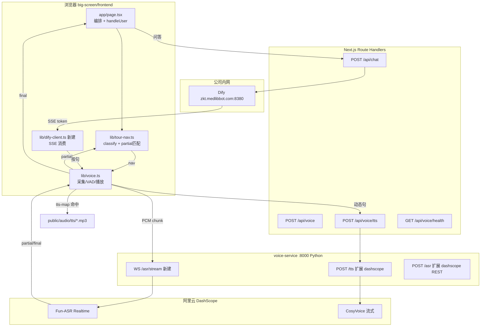

# 方案 A · 语音混合架构 · 实施指南

> **状态**：规划文档，待按步骤实施  
> **日期**：2026-08-17  
> **方案**：阿里云 Fun-ASR 流式 + 预录 mp3 导航 + CosyVoice 动态 TTS + Dify 知识问答  
> **关联**：[07-语音链路](../features/07-语音链路.md)、[09-导航触发表](../features/09-导航触发表.md)

---

## 0. 方案目标（三个需求）

| 需求 | 通路 | 引擎 |
|------|------|------|
| ① 反应快 | partial → 投机导航 → 预录播放 | Fun-ASR 流式 + Silero VAD + 热词 |
| ② 声音顺（引导） | `navigateTo()` → `aiSay()` → `tts-map.json` | **预录 mp3**（不改） |
| ② 声音顺（问答） | Dify SSE → 按句 → 流式 TTS | CosyVoice |
| ③ 知识问答 | 问句 → `/api/chat` → Dify RAG | 现有 route 扩展 SSE |

---

## 1. 当前代码实测基线（2026-08-17）

| 现状 | 代码位置 |
|------|----------|
| ASR：录完整段 WAV → POST `/api/voice` → Vosk | `frontend/lib/voice.ts` L730-737；`voice-service/server.py` L375-394 |
| 端点：连续静音 **700ms** 才提交 | `voice.ts` L362 `MIN_SILENCE_MS` |
| TTS：**54 条**预录 mp3 优先 → Piper 逐句兜底 | `lib/tts-map.json`；`voice.ts` L752-794 |
| 意图：`classify()` 返回 `nav/training/chat/unknown` | `lib/tour-nav.ts` L678-863 |
| **`chat` 未接入**：`handleUser` 只处理 nav/training，其余 fallback | `app/page.tsx` L528-554 |
| Dify：`/api/chat` + `lib/dify.ts` 存在，**前端未调用** | `app/api/chat/route.ts`；`docs/README.md` |
| 云端 ASR：`ASR_BACKEND=cloud` 返回 **501** | `server.py` L381-382 |
| 讲解中禁麦：`speaking` 时 `startListening` return | `page.tsx` L557 |
| `loading` 状态已定义但 **从未 setLoading(true)** | `page.tsx` L88, L529 |

---

## 2. 目标架构



### 网络前提

| 服务 | 地址 | 需要什么 |
|------|------|----------|
| DashScope | `dashscope.aliyuncs.com` | 能上网的 WiFi，**不需要 Clash** |
| Dify | `zkt.medlibbot.com:8380` | **公司内网** |
| voice-service | `127.0.0.1:8000` | 本机，与 WiFi 无关 |

`frontend/dev.sh` 已设置 `NO_PROXY=127.0.0.1,localhost`——访问本机 voice-service 不受 Clash 影响；DashScope 请求在 voice-service 内发出，需能直连公网。

---

## 3. 分步实施（7 步）

### Step 0 · 环境与网络验收（0.5 天）

**做什么**

1. 阿里云百炼开通 Fun-ASR Realtime + CosyVoice，获取 `DASHSCOPE_API_KEY`
2. Dify 应用配置输入变量 `scene`（string）
3. 填写环境变量

`big-screen/frontend/.env.local`：

```env
DIFY_API_BASE=http://zkt.medlibbot.com:8380/v1
DIFY_API_KEY=app-xxx
DASHSCOPE_API_KEY=sk-xxx

NEXT_PUBLIC_VOICE_ASR=stream          # 新建：batch | stream
NEXT_PUBLIC_VAD_ENGINE=silero         # 新建：energy | silero
VOICE_SERVICE_URL=http://127.0.0.1:8000
```

`big-screen/voice-service/.env`（或 start 脚本 export）：

```env
ASR_BACKEND=dashscope
TTS_BACKEND=dashscope
DASHSCOPE_API_KEY=sk-xxx
DASHSCOPE_ASR_MODEL=fun-asr-realtime
DASHSCOPE_TTS_MODEL=cosyvoice-v3-flash
DASHSCOPE_TTS_VOICE=longxiaochun_v2
```

**验收命令**

```bash
curl -I https://dashscope.aliyuncs.com
curl -I http://zkt.medlibbot.com:8380
curl http://127.0.0.1:8000/health
```

---

### Step 1 · Dify 问答闭环（blocking，1 天）

**目标**：需求 ③ 先跑通；不动 ASR。

| 文件 | 改动 |
|------|------|
| `lib/tour-nav.ts` | 新增 `export function isQuestionText(t: string): boolean` |
| `lib/dify-client.ts` | **新建** `askDifyBlocking(message, scene, conversationId)` |
| `app/page.tsx` | `handleUser` 增加 chat / unknown+问句 → Dify；`convIdRef`；`setLoading` |

**`handleUser` 目标逻辑**（替换 `page.tsx` L528-554 分支）：

```
classify(text)
  ├─ nav      → navigateTo()        // 不变，走预录
  ├─ training → training.pointer    // 不变
  ├─ chat     → askDify()
  ├─ unknown + isQuestionText() → askDify()
  └─ else     → global.fallback
```

**本步不改**：`voice.ts`、`server.py` ASR。

---

### Step 2 · 动态 TTS 换 CosyVoice（1 天）

**目标**：问答侧顺滑；导航仍预录。

| 文件 | 改动 |
|------|------|
| `voice-service/requirements.txt` | 加 `dashscope>=1.20.0`, `websockets>=12.0` |
| `voice-service/dashscope_tts.py` | **新建** CosyVoice 合成（先 REST 整句，Step 6 改流式） |
| `voice-service/server.py` | `TTS_BACKEND=dashscope` 分支 |
| `lib/voice.ts` | 无 tts-map 命中时走 CosyVoice（替换 Piper 兜底） |

**播放策略**：沿用 `playNextSentence` 队列（`voice.ts` L269-320）；预录 mp3 逻辑不动。

---

### Step 3 · ASR 换 DashScope REST（1 天）

**目标**：识别准确率提升；架构仍是批处理。

| 文件 | 改动 |
|------|------|
| `voice-service/dashscope_asr.py` | **新建** 短音频 REST 识别 |
| `server.py` | 实现 `ASR_BACKEND=dashscope`；保留 `vosk` 作 fallback |

---

### Step 4 · Silero VAD（0.5–1 天）

**目标**：停嘴等待 700ms → ~350ms。

| 文件 | 改动 |
|------|------|
| `frontend/package.json` | 加 `@ricky0123/vad-web` |
| `lib/voice.ts` | `NEXT_PUBLIC_VAD_ENGINE=silero` 分支 |

---

### Step 5 · 流式 ASR + partial 导航投机（2–3 天）★核心

**目标**：导航「接近 0 延迟」。

| 文件 | 改动 |
|------|------|
| `voice-service/ws_asr_bridge.py` | **新建** 浏览器 WS ↔ DashScope Fun-ASR WS 桥接 |
| `server.py` | 启动 WS 服务 |
| `lib/voice.ts` | `createStreamingVoice()`；`listen()` 推 PCM chunk；`onPartial` 回调 |
| `lib/nav-speculative.ts` | **新建** `matchNavFromPartial(partial, nav)` |
| `app/page.tsx` | `onPartial` → 命中则 `navigateTo` + `speculativeLockRef` |

**`VoiceProvider.listen` 扩展**：

```ts
listen(
  onResult,
  onError?,
  onDebug?,
  onPartial?: (text: string) => void   // 新增
)
```

**DashScope 热词**（run-task parameters）：

```
宣传廊、模拟药店、药品区、器械区、化妆品区、科普、法规、案例、返回
```

---

### Step 6 · Dify SSE + CosyVoice 流式 TTS（1–2 天）

| 文件 | 改动 |
|------|------|
| `lib/dify.ts` | 新增 `streamFromDify()` |
| `app/api/chat/route.ts` | 支持 `stream: true` → SSE |
| `lib/dify-client.ts` | 按句切分 → 立刻 `speak(sentence)` |
| `voice-service/dashscope_tts.py` | WebSocket 流式；`/tts/stream` |
| `lib/voice.ts` | `speakStreamSentence()` 边收边播 |

---

### Step 7 · 讲解中点麦打断（可选，1 天）

| 文件 | 改动 |
|------|------|
| `app/page.tsx` | 去掉 `speaking` 禁麦；`interactionMode: guiding \| qna`；checkpoint 续播 |
| `lib/voice.ts` | QNA 态开 `echoCancellation: true` |

---

## 4. 文件改动总览

```
big-screen/
├── frontend/
│   ├── package.json                    Step 4
│   ├── .env.local.example              Step 0
│   ├── lib/
│   │   ├── voice.ts                    Step 4/5/6
│   │   ├── tour-nav.ts                 Step 1
│   │   ├── dify-client.ts              Step 1/6 新建
│   │   ├── nav-speculative.ts          Step 5 新建
│   │   └── dify.ts                     Step 6
│   ├── app/
│   │   ├── page.tsx                    Step 1/5/7
│   │   └── api/chat/route.ts           Step 6
│   └── public/audio/tts/*.mp3          不动
└── voice-service/
    ├── requirements.txt                Step 2
    ├── server.py                       Step 2/3/5
    ├── dashscope_asr.py                Step 3/5 新建
    ├── dashscope_tts.py                Step 2/6 新建
    └── ws_asr_bridge.py                Step 5 新建
```

**不动**：`navigateTo()`、`tts-map.json`、`tour-scripts.json` 导航话术、`classify()` 导航规则主体。

---

## 5. 测试用例

### TC-0 网络与环境（Step 0）

| ID | 操作 | 预期 |
|----|------|------|
| TC-0-1 | `curl http://127.0.0.1:8000/health` | `asr_backend=dashscope`, `ok:true` |
| TC-0-2 | 浏览器 `/api/voice/health` | `reachable:true` |
| TC-0-3 | 公司内网访问 Dify | 非 502 |
| TC-0-4 | voice-service 连 DashScope | 无 proxy 超时 |

### TC-1 Dify 问答（Step 1）

| ID | 用户输入 | 预期 |
|----|----------|------|
| TC-1-1 | 「药品和非药品怎么区分？」 | Dify 答案，非 fallback |
| TC-1-2 | 「化妆品标签不能写什么？」 | 命中知识库 |
| TC-1-3 | 「去模拟药店」 | **nav**，不走 Dify |
| TC-1-4 | 「你好安安」 | chat → Dify |
| TC-1-5 | 「巴拉巴拉」 | global.fallback |
| TC-1-6 | 连续两问 | conversationId 保留 |

### TC-2 动态 TTS（Step 2）

| ID | 操作 | 预期 |
|----|------|------|
| TC-2-1 | 问答 | CosyVoice 女声，非 Piper 男声 |
| TC-2-2 | 「去宣传廊」 | 预录 mp3，无 TTS POST |
| TC-2-3 | 长答案 | 多句连续播 |

### TC-3 ASR 准确率（Step 3）

| ID | 输入 | 预期 |
|----|------|------|
| TC-3-1 | 「去宣传廊」 | nav → corridor |
| TC-3-2 | 「模拟药店」 | nav → pharmacy |
| TC-3-3 | 「器械区」 | aspect device |
| TC-3-4 | 「案例一」 | case1 |

### TC-4 VAD（Step 4）

| ID | 操作 | 预期 |
|----|------|------|
| TC-4-1 | 短句「返回」 | 停嘴后 ≤500ms 提交 ASR |
| TC-4-2 | 「我想…去宣传廊」 | 不在句中截断 |
| TC-4-3 | 环境噪声 | 5s 无 speech 取消 |

### TC-5 流式导航投机（Step 5）★

| ID | 输入 | 预期 | 指标 |
|----|------|------|------|
| TC-5-1 | 「我想去模拟药店」 | partial 命中即切 pharmacy + 预录 | 话未说完可开声 |
| TC-5-2 | 「普法宣传廊」 | 投机 corridor | partial 触发 |
| TC-5-3 | 宣传廊总览说「药品区」 | aspect=drug | — |
| TC-5-4 | 一次说话 | navigateTo 只 1 次 | 无双重导航 |
| TC-5-5 | final 与 partial 矛盾 | 以 final 为准 | — |

**指标**：partial 命中 → 预录 onStart ≤ **800ms**；停嘴 → 开声 ≤ **500ms**。

### TC-6 流式问答（Step 6）

| ID | 操作 | 预期 |
|----|------|------|
| TC-6-1 | 问法规 | 首句 ≤3s 开声 |
| TC-6-2 | 长回答 | 句间无硬切 |
| TC-6-3 | 导航+问答交替 | 导航预录 / 问答 CosyVoice |

### TC-7 回归（每步必跑）

| ID | 操作 | 预期 |
|----|------|------|
| TC-R-1 | 完整迎宾流 | intro → 视频 → choice |
| TC-R-2 | 屏幕按钮切场景 | 与语音一致 |
| TC-R-3 | 35s 无操作 | 回视频模式 |
| TC-R-4 | 15s 选择超时 | 默认宣传廊 |
| TC-R-5 | 刷新页面 | 回迎宾 |

---

## 6. 实施时间表（单人）

```
Week 1   Step 0 → 1 → 2     验收 TC-0, TC-1, TC-2, TC-R
Week 2   Step 3 → 4 → 5前半  验收 TC-3, TC-4
Week 3   Step 5后半 → 6     验收 TC-5, TC-6, TC-R 全量
Week 4   Step 7（可选）      打断问询
```

**MVP**：Step 0+1+2+3 → 问答 + 识别提升 + 导航预录。  
**核心体验**：+ Step 4+5 → 导航快。  
**完整方案 A**：+ Step 6。

---

## 7. 风险与回退

| 风险 | 回退 |
|------|------|
| DashScope 连不上 | `ASR_BACKEND=vosk`, `TTS_BACKEND=piper` |
| Silero 加载失败 | `NEXT_PUBLIC_VAD_ENGINE=energy` |
| 流式 WS 不稳定 | `NEXT_PUBLIC_VOICE_ASR=batch` |
| Dify 内网不通 | 问答不可用；导航不受影响 |
| partial 误触发 | 关闭投机，仅 final 导航 |

---

## 8. 参考链接

- [Step 0 学习文档（边做边学）](../learn/step-00-环境与网络验收.md)
- [Fun-ASR Realtime WebSocket API](https://help.aliyun.com/zh/model-studio/fun-asr-realtime-websocket-api)
- [Fun-ASR 服务端事件（partial/final）](https://help.aliyun.com/zh/model-studio/fun-asr-server-events)
- [CosyVoice 语音合成](https://help.aliyun.com/zh/model-studio/tts-model)
